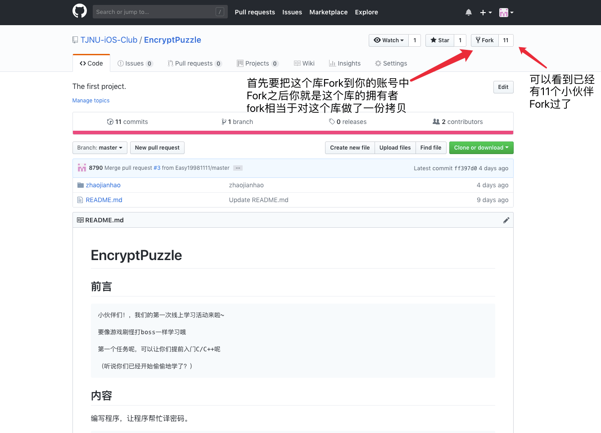
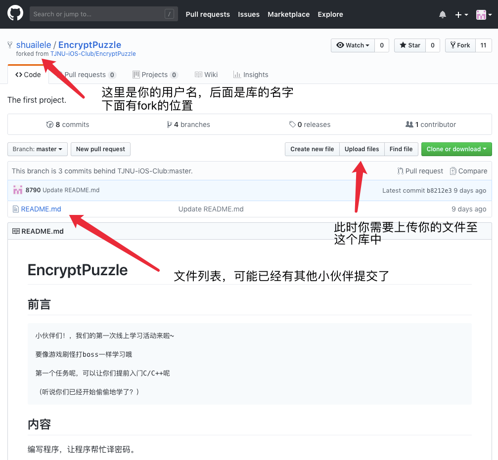
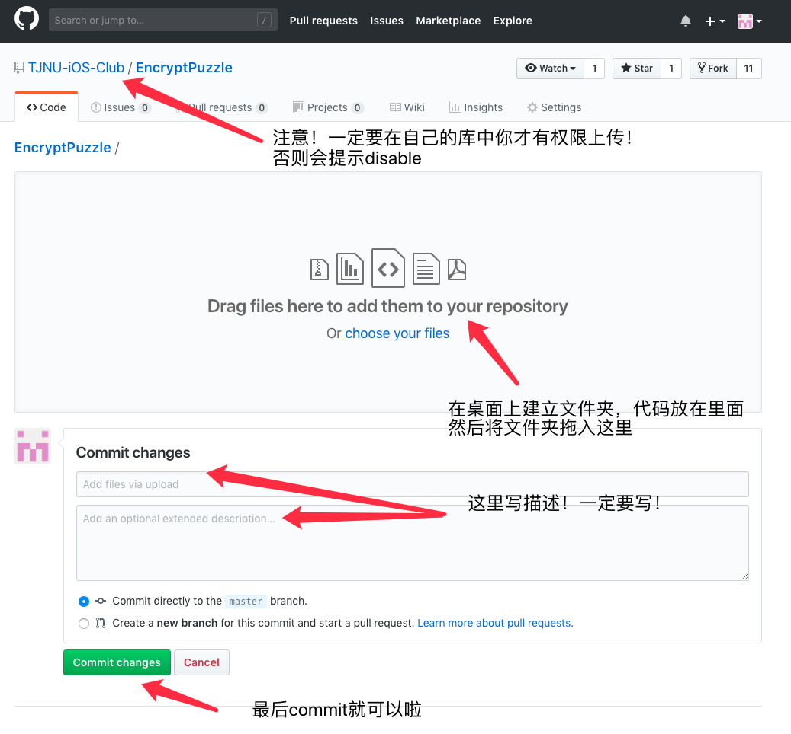

# 关于Github的最简单提交方法教程

## Git基本原理

Git是一个代码仓库，他会帮你保存你的代码以及做出的所有更改，这一点在个人使用以及多人群组操作的时候异常有用。这里我们使用github这个远程代码仓库来提交代码。

## 关于Github

GitHub是一个程序员不可不知的地方。作为开源代码库以及版本控制系统，Github拥有超过900万开发者用户。随着越来越多的应用程序转移到了云上，Github已经成为了管理软件开发以及发现已有代码的首选方法。

## 关于提交代码

GitHub可以托管各种git库，并提供一个web界面，为一个项目贡献代码非常简单：首先点击项目站点的“fork”的按钮，然后将代码检出并将修改加入到刚才分出的代码库中，最后通过内建的“pull request”机制向项目负责人申请代码合并。已经有人将GitHub称为代码玩家的MySpace。

## 详细步骤

